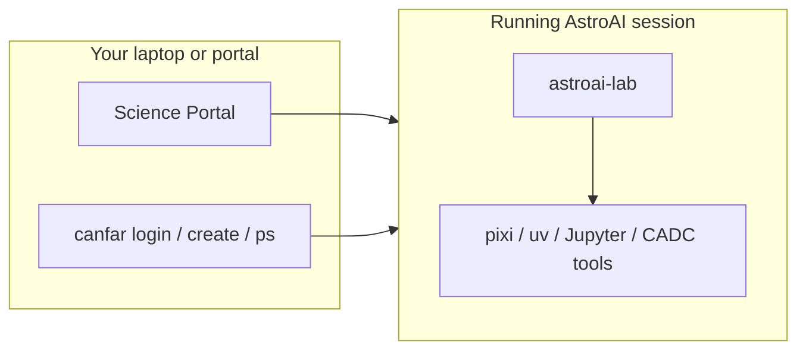
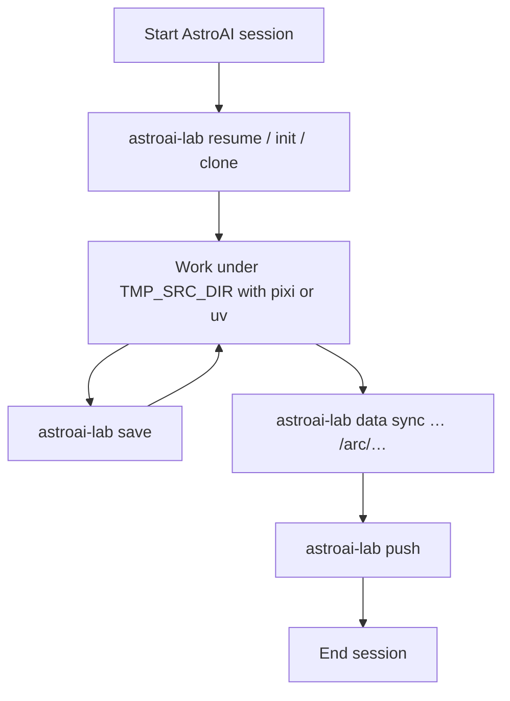

# astroai-lab

In-session workbench CLI for **AstroAI** sessions on the
[CANFAR Science Platform](https://www.opencadc.org/canfar/).

Use the platform client [`canfar`](https://github.com/opencadc/canfar) to log in and
start sessions. Use **`astroai-lab`** inside a running session for projects,
environment save/resume, data movement, hygiene checks, and AI agent setup.



## Names at a glance

| Name | Meaning |
|------|---------|
| **AstroAI** | Product: GitHub org [`astroai`](https://github.com/astroai), Harbor project `astroai`, session images and tools |
| **CANFAR** | Science Platform: portal, Skaha, `/arc`, authentication, session scheduling |
| **`canfar`** | Platform CLI — auth, create/list/delete sessions, images |
| **`astroai-lab`** | This package — workbench **inside** a session |
| **`images.canfar.net/astroai/*`** | AstroAI images hosted on CANFAR Harbor |

Session images and how to launch them:
[astroai-containers](https://github.com/astroai/astroai-containers).

## Session loop

```bash
astroai-lab resume mylab          # or: init / clone
cd "$WORK/mylab" && pixi run python analysis.py
astroai-lab save                  # anytime
astroai-lab push                  # before closing the session
```

Printable cheat sheet: `astroai-lab guide` · [docs/guide.md](docs/guide.md)



## Install

AstroAI session images already include `astroai-lab` on PATH.

On a laptop or for development (package is published from GitHub):

```bash
uv tool install git+https://github.com/astroai/astroai-lab.git
# or:
pip install "git+https://github.com/astroai/astroai-lab.git"
```

Editable checkout:

```bash
uv sync --all-extras
uv run astroai-lab --help
```

## Quick start (inside a session)

```bash
astroai-lab                  # status banner
astroai-lab init mylab
astroai-lab clone owner/repo
astroai-lab save mylab
astroai-lab resume mylab
astroai-lab push
astroai-lab paths            # work / scratch / cache paths
astroai-lab tools            # tools on PATH
astroai-lab check            # quick health check
astroai-lab doctor           # full diagnostic
```

Machine-readable output: add **`--json`** where supported
(`status`, `paths`, `tools`, `check`, `doctor`, …).

## AI coding agents

Optional — once per user on persistent `/arc` home:

```bash
astroai-lab agent setup
astroai-lab agent install kilo       # or goose, cline, opencode, qoder, …
astroai-lab agent models free
gh auth login
```

After an image upgrade: `astroai-lab agent update`. Overview: `astroai-lab agent list`.
Curated addons: `astroai-lab agent addons` · `astroai-lab agent add ponytail`.
Broken configs: `astroai-lab agent verify`. Details in [docs/cli.md](docs/cli.md).

## Configuration

Paths come from Skaha session variables (`TMP_SRC_DIR`, `TMP_SCRATCH_DIR`).
Optional preferences: **`~/.astroai/lab/config.yaml`** — see [docs/config.md](docs/config.md).

## Documentation

| Doc | Audience |
|-----|----------|
| [docs/USAGE.md](docs/USAGE.md) | Newcomers and daily use — storage, CADC, workflows |
| [docs/guide.md](docs/guide.md) | Short session cheat sheet |
| [docs/cli.md](docs/cli.md) | Full CLI reference |
| [docs/config.md](docs/config.md) | Optional YAML / env overrides |

Related:

| Repo | Role |
|------|------|
| [astroai-containers](https://github.com/astroai/astroai-containers) | Session images (`webterm`, `notebook`, `ray-manager`, …) |
| [astroai-workload](https://github.com/astroai/astroai-workload) | Ray Jobs submit helpers |
| [canfar](https://github.com/opencadc/canfar) | Platform client |

Platform documentation: [opencadc.github.io/canfar](https://opencadc.github.io/canfar/)

## Development

```bash
./scripts/ci.sh                 # ruff + pytest with coverage
uv sync --all-extras
uv run pytest -q
astroai-lab --install-completion bash
```

## License

[MIT](LICENSE). The external [`canfar`](https://github.com/opencadc/canfar) client
keeps its own upstream license.
