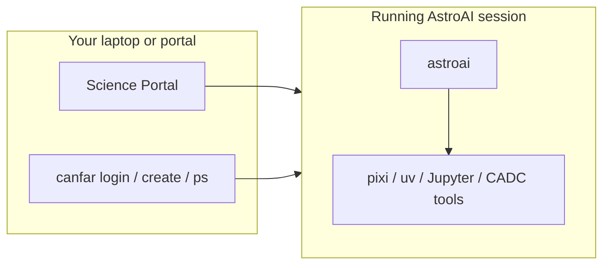
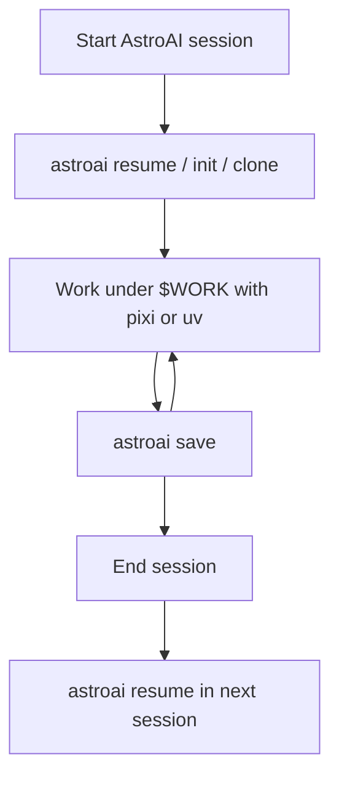

# astroai-lab

In-session workbench CLI for **AstroAI** sessions on the
[CANFAR Science Platform](https://www.opencadc.org/canfar/).

Use the platform client [`canfar`](https://github.com/opencadc/canfar) to log in and
start sessions. Use **`astroai`** inside a running session for environment
save/resume, AI agents, the Ray cluster, session status, and notebook kernels.


```mermaid
flowchart LR
  subgraph laptop [Your laptop or portal]
    Portal[Science Portal]
    CanfarCLI["canfar login / create / ps"]
  end
  subgraph session [Running AstroAI session]
    Lab["astroai"]
    Tools["pixi / uv / Jupyter / CADC tools"]
  end
  Portal --> session
  CanfarCLI --> session
  Lab --> Tools
```

## Names at a glance

| Name | Meaning |
|------|---------|
| **AstroAI** | Product: GitHub org [`astroai`](https://github.com/astroai), Harbor project `astroai`, session images and tools |
| **CANFAR** | Science Platform: portal, Skaha, `/arc`, authentication, session scheduling |
| **`canfar`** | Platform CLI — auth, create/list/delete sessions, images, `canfar data` |
| **`astroai`** | This package — workbench **inside** a session |
| **`images.canfar.net/astroai/*`** | AstroAI images hosted on CANFAR Harbor |

Session images and how to launch them:
[astroai-containers](https://github.com/astroai/astroai-containers).

## Session loop

```bash
astroai resume mylab          # or: init / clone
cd "$WORK/mylab" && pixi run python analysis.py
astroai save                  # anytime — lockfile snapshot to /arc
```

All command help: `astroai help` · one command: `astroai help -c agent` · Cheat sheet: [docs/help.md](docs/help.md)


```mermaid
flowchart TD
  A[Start AstroAI session] --> B["astroai resume / init / clone"]
  B --> C[Work under $WORK with pixi or uv]
  C --> D["astroai save"]
  D --> C
  D --> E[End session]
  E --> F["astroai resume in next session"]
```

## Install

AstroAI session images already include `astroai` on PATH.

On a laptop or for development (package is published from GitHub):

```bash
uv tool install git+https://github.com/astroai/lab.git
# or:
pip install "git+https://github.com/astroai/lab.git"
```

Editable checkout:

```bash
uv sync --all-extras
uv run astroai --help
```

## Quick start (inside a session)

```bash
astroai                  # status banner
astroai init mylab
astroai clone owner/repo
astroai save mylab
astroai resume mylab
astroai save --list
astroai status           # quotas, team projects, canfar auth/ps
astroai cluster start --autoscaling
astroai cluster check
astroai kernel ensure    # notebook kernels
```

Machine-readable output: add **`--json`** where supported
(`status`, `save --list`, `config show`, `agent …`).

## AI coding agents

Optional — once per user on persistent `/arc` home:

```bash
astroai agent setup
astroai agent install kilo       # or goose, cline, opencode, qoder, …
astroai agent install cursor
gh auth login
```

After an image upgrade: `astroai agent update`. Overview: `astroai agent list`.
Plugins: `astroai agent plugins list` · `astroai agent plugins install ponytail`.
Broken configs: `astroai agent verify`. Details in [docs/cli.md](docs/cli.md).

## Scope

`astroai` is the in-session CLI: environment save/resume, AI agents,
Ray cluster start/run, session status, notebook kernels, and shell env export.
Data movement is the platform's job — use **`canfar data`** for archive I/O and
`vcp` / `vls` for VOSpace. Team project provisioning is done by operators;
users read `/arc/projects` via `astroai status`.

## Configuration

Paths come from Slurm-style session variables (`WORK`, `SCRATCH`, `PROJECT`),
set by the Skaha platform and detected under `/arc/projects`.
Optional preferences: **`~/.astroai/lab/config.yaml`** — see [docs/config.md](docs/config.md).

## Documentation

| Doc | Audience |
|-----|----------|
| [docs/USAGE.md](docs/USAGE.md) | Newcomers and daily use — storage, CADC, workflows |
| [docs/help.md](docs/help.md) | Short session cheat sheet |
| [docs/cli.md](docs/cli.md) | Full CLI reference |
| [docs/config.md](docs/config.md) | Optional YAML / env overrides |

Related:

| Repo | Role |
|------|------|
| [astroai-containers](https://github.com/astroai/astroai-containers) | Session images (`webterm`, `notebook`, `ray-manager`, …) |
| [canfar](https://github.com/opencadc/canfar) | Platform client |

Platform documentation: [opencadc.github.io/canfar](https://opencadc.github.io/canfar/)

## Development

```bash
./scripts/ci.sh                 # ruff + pytest with coverage
uv sync --all-extras
uv run pytest -q
astroai --install-completion bash
```

## License

[MIT](LICENSE). The external [`canfar`](https://github.com/opencadc/canfar) client
keeps its own upstream license.
