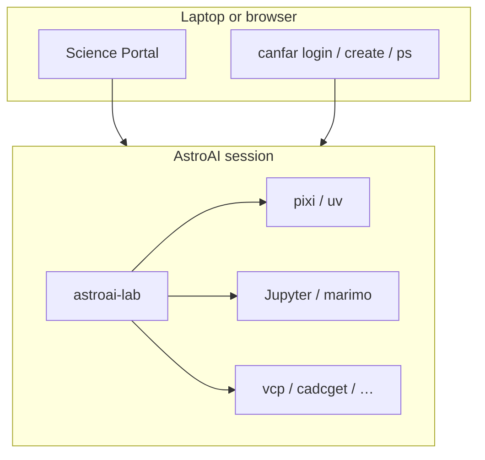
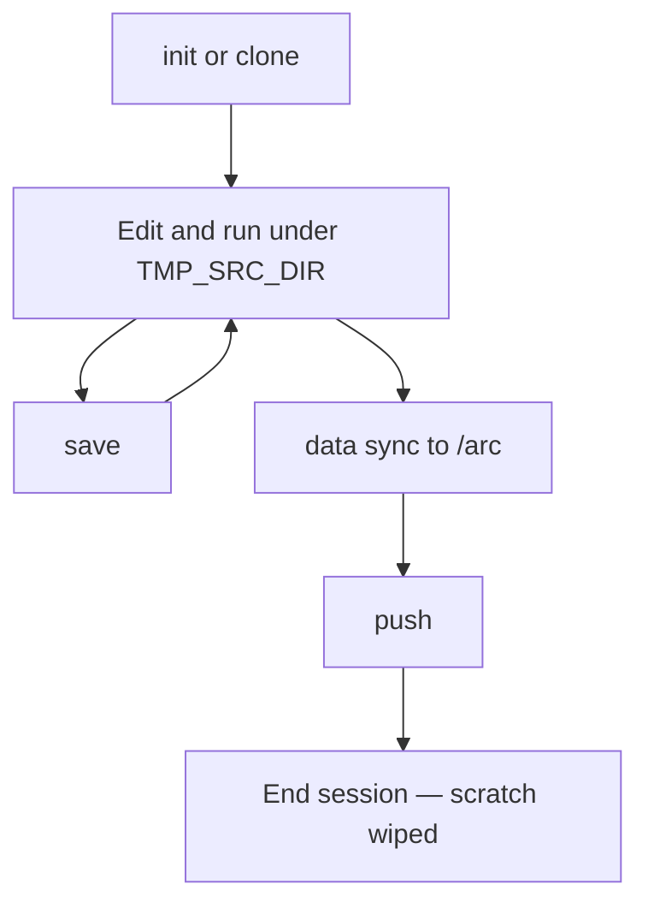

# astroai-lab usage

**astroai-lab** is the in-session workbench for AstroAI sessions on the
[CANFAR Science Platform](https://www.opencadc.org/canfar/).

It works alongside:

| Tool | Role |
|------|------|
| [`canfar`](https://github.com/opencadc/canfar) | Platform auth and session lifecycle |
| CADC clients (`cadcget`, `cadc-tap`, `vcp`, …) | Archive and VOSpace I/O in session images |
| [Session images](https://github.com/astroai/astroai-containers) | `webterm`, `notebook`, `vscode`, `marimo`, Ray |

| Doc | Scope |
|-----|--------|
| **USAGE.md** (this file) | Narrative: where to work, storage, workflows |
| [guide.md](guide.md) | Short session loop |
| [cli.md](cli.md) | Full CLI reference |
| [config.md](config.md) | Optional `~/.astroai/lab/config.yaml` |

In a session: `astroai-lab guide` · `less /opt/astroai/USAGE.md` (image user guide).

Platform docs: [opencadc.github.io/canfar](https://opencadc.github.io/canfar/)

---

## Where you work



| Where | What you do | Tools |
|-------|-------------|--------|
| **Laptop / browser** | Log in, start and stop sessions | Science Portal, or `canfar login` / `canfar create` / `canfar ps` |
| **Inside a session** | Code, notebooks, training, agents | `astroai-lab`, Jupyter, pixi/uv, CADC clients |

`astroai-lab` commands run **inside** the session (terminal, notebook cell, or VS Code).

### Student path (notebook-first)

1. Open the [Science Portal](https://www.canfar.net/science-portal) → launch **notebook** or **marimo** (pick a GPU node only if you need a GPU).
2. **Jupyter:** open `/opt/astroai/notebooks/starter.ipynb` (or `astroai-lab notebook starter`) and select the AstroAI kernel (`astroai-lab kernel ensure` if needed).
3. **Marimo:** the session opens `TMP_SRC_DIR/notebooks/starter.py` (seeded once); or run `astroai-lab notebook starter marimo`.
4. Run `astroai-lab doctor` — caches should resolve under `/scratch`, not `$HOME`.
5. Keep long-lived results with `astroai-lab data sync … /arc/projects/…` or `vcp` to VOSpace.
6. Later: `astroai-lab init` / `clone` plus pixi or uv for project environments.

VOSpace: use **`vls` / `vcp`** from the image (or the interim Vault widget in the
marimo starter). Native marimo **Remote Storage** for Vault waits on `vos`
fsspec support. There is no separate `astroai-lab` VOSpace wrapper.

---

## Install

Session images ship `astroai-lab` on PATH under `/opt/astroai/venv/cadc`.

Elsewhere (GitHub; not required for portal users):

```bash
uv tool install git+https://github.com/astroai/astroai-lab.git
pip install "git+https://github.com/astroai/astroai-lab.git"
```

Development checkout:

```bash
uv sync --all-extras
uv run astroai-lab --help
./scripts/ci.sh
```

---

## First project

```bash
astroai-lab init mylab
cd "$WORK/mylab"
pixi add numpy
pixi run python -c "import numpy; print(numpy.__version__)"
astroai-lab save mylab
```

Clone an existing GitHub repo (needs `gh auth login` once):

```bash
astroai-lab clone owner/repo
astroai-lab clone --from-env mylab owner/repo   # optional: warm from a named save
```

End of session:

```bash
astroai-lab push --yes
```

`push` runs git push when applicable and saves the environment lockfiles to `/arc`.



---

## Storage

| Tier | Env / path | Lifetime | Use for |
|------|------------|----------|---------|
| Work | `TMP_SRC_DIR` (`/srcdir`) | Session | Source trees, pixi/uv projects |
| Scratch | `TMP_SCRATCH_DIR` (`/scratch`) | Session | Datasets, build caches, temp |
| Home | `/arc/home/<you>` | Persistent | Config, `~/.astroai/lab/saves/`, certs |
| Projects | `/arc/projects/<group>` | Persistent | Shared data and team env-saves |

Inspect resolved paths:

```bash
astroai-lab paths
astroai-lab paths --json
```

Move data:

```bash
astroai-lab data stage /arc/projects/mygroup/raw   # → scratch
astroai-lab data sync /scratch/results /arc/projects/mygroup/results
```

Hourly backup of the work directory to `/arc/home`:

```bash
astroai-lab backup status
astroai-lab backup run                 # one-shot
# daemon starts automatically in AstroAI sessions
```

---

## Working with `canfar` and CADC

From a laptop or any AstroAI session:

```bash
canfar login
canfar create --name demo webterm
canfar ps
canfar open <session-id>
canfar delete <session-id>
```

CADC / VOSpace examples (image PATH):

```bash
cadcget …
vls vos:…
vcp ./local.fits vos:…
```

`astroai-lab status` includes `canfar auth show` and `canfar ps` when the CLI is available.

---

## Command map

| Goal | Command |
|------|---------|
| Status banner | `astroai-lab` |
| New project | `astroai-lab init NAME` |
| Clone + install | `astroai-lab clone REPO` |
| Snapshot env | `astroai-lab save [NAME]` |
| Restore env | `astroai-lab resume NAME` |
| List saves | `astroai-lab saves` |
| Close-out | `astroai-lab push` |
| Quotas / sessions | `astroai-lab status` |
| Paths / tools | `astroai-lab paths` · `astroai-lab tools` |
| Health | `astroai-lab check` · `astroai-lab doctor` |
| Data | `astroai-lab data stage\|sync` |
| Clean caches | `astroai-lab clean home\|cache` |
| Jupyter | `astroai-lab kernel ensure` · `astroai-lab notebook starter` |
| Agents | `astroai-lab agent setup\|install\|…` |
| Team dir | `astroai-lab project init` |

Full flags: [cli.md](cli.md).

---

## AI coding agents

Persists under `/arc` home (MCP, skills, tool binaries):

```bash
astroai-lab agent setup
astroai-lab agent install kilo     # or goose, opencode, qoder, …
astroai-lab agent addons           # curated lean + science skills/MCP
astroai-lab agent add ponytail     # YAGNI / minimal diffs
astroai-lab agent models free
astroai-lab agent update           # after image upgrades
astroai-lab agent list             # CLIs + bundles + skills overview
astroai-lab agent verify           # catch broken JSON/TOML/YAML configs
```

See [cli.md](cli.md) for `agent models free --preset long` and per-agent options.

---

## Troubleshooting

| Symptom | What to run |
|---------|-------------|
| Paths look wrong / caches under `$HOME` | `astroai-lab doctor --json` then fix env with a login shell (`bash -l`) |
| Env save failed | `astroai-lab status` (quota); `astroai-lab clean home --all-safe --dry-run` |
| Kernel missing in Jupyter | `astroai-lab kernel ensure` |
| `canfar` unknown | Confirm you are on an AstroAI image; `astroai-lab tools` |
| Need a printable loop | `astroai-lab guide` |

---

## See also

- [astroai-containers USAGE](https://github.com/astroai/astroai-containers/blob/main/docs/USAGE.md) — images, portal session types
- [Ray on AstroAI](https://github.com/astroai/astroai-containers/blob/main/docs/RAY.md) — distributed clusters
- [astroai-workload](https://github.com/astroai/astroai-workload) — submit Ray Jobs from Python
- [CANFAR client docs](https://opencadc.github.io/canfar/)
