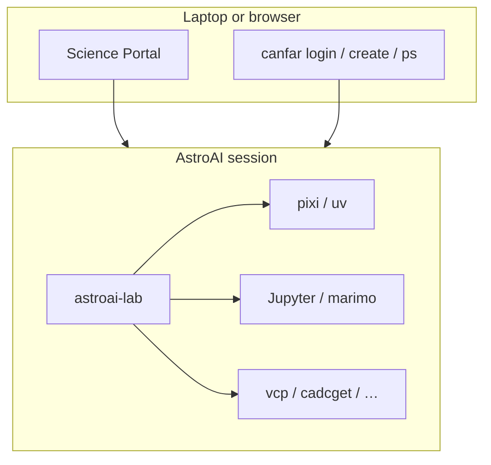
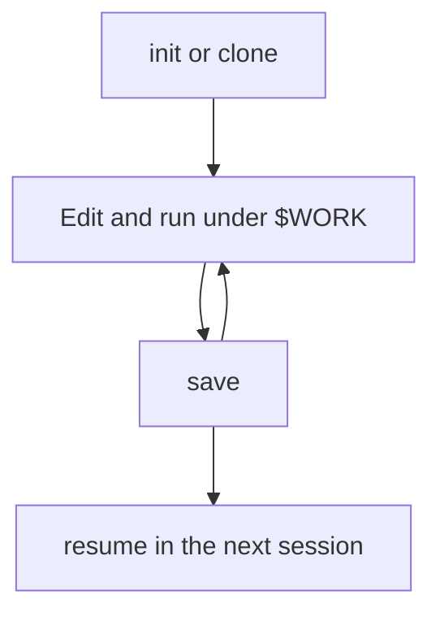

# astroai usage

**astroai-lab** is the in-session workbench for AstroAI sessions on the
[CANFAR Science Platform](https://www.opencadc.org/canfar/). One binary,
`astroai`: environment save/resume, AI agents, and the Ray cluster
(`cluster start` / `run`).

It works alongside:

| Tool | Role |
|------|------|
| [`canfar`](https://github.com/opencadc/canfar) | Platform auth, session lifecycle, `canfar data` archive I/O |
| CADC clients (`cadcget`, `cadc-tap`, `vcp`, …) | Archive and VOSpace I/O in session images |
| [Session images](https://github.com/astroai/astroai-containers) | `webterm`, `notebook`, `vscode`, `marimo`, Ray |

| Doc | Scope |
|-----|--------|
| **USAGE.md** (this file) | Narrative: where to work, storage, workflows |
| [help.md](help.md) | Short session loop |
| [cli.md](cli.md) | Full CLI reference |
| [config.md](config.md) | Optional `~/.astroai/lab/config.yaml` |

In a session: `astroai help` · `less /opt/astroai/USAGE.md` (image user guide).

Platform docs: [opencadc.github.io/canfar](https://opencadc.github.io/canfar/)

---

## Where you work


```mermaid
flowchart TB
  subgraph outside [Laptop or browser]
    SP[Science Portal]
    CF["canfar login / create / ps"]
  end
  subgraph session [AstroAI session]
    AL[astroai-lab]
    PM[pixi / uv]
    NB[Jupyter / marimo]
    CADC[vcp / cadcget / …]
  end
  SP --> session
  CF --> session
  AL --> PM
  AL --> NB
  AL --> CADC
```

| Where | What you do | Tools |
|-------|-------------|--------|
| **Laptop / browser** | Log in, start and stop sessions | Science Portal, or `canfar login` / `canfar create` / `canfar ps` |
| **Inside a session** | Code, notebooks, training, agents | `astroai`, Jupyter, pixi/uv, CADC clients |

`astroai` commands run **inside** the session (terminal, notebook cell, or VS Code).

### Student path (notebook-first)

1. Open the [Science Portal](https://www.canfar.net/science-portal) → launch **notebook** or **marimo** (pick a GPU node only if you need a GPU).
2. **Jupyter:** open `/opt/astroai/notebooks/starter.ipynb` and select the AstroAI kernel (`astroai kernel ensure` if needed).
3. **Marimo:** the session opens `$WORK/notebooks/starter.py` (seeded once).
4. Run `astroai status` to check paths and quotas.
5. Keep long-lived results with `canfar data` or `vcp` to VOSpace.
6. Later: `astroai init` / `clone` plus pixi or uv for project environments.

VOSpace: use **`vls` / `vcp`** from the image (or the interim Vault widget in the
marimo starter). There is no separate `astroai` VOSpace wrapper.

---

## Install

Session images ship `astroai` on PATH under `/opt/astroai/venv/cadc`.

Elsewhere (GitHub; not required for portal users):

```bash
uv tool install git+https://github.com/astroai/lab.git
pip install "git+https://github.com/astroai/lab.git"
```

Development checkout:

```bash
uv sync --all-extras
uv run astroai --help
./scripts/ci.sh
```

---

## First project

```bash
astroai init mylab
cd "$WORK/mylab"
pixi add numpy
pixi run python -c "import numpy; print(numpy.__version__)"
astroai save mylab
```

Clone an existing GitHub repo (needs `gh auth login` once):

```bash
astroai clone owner/repo
astroai clone owner/a owner/b
astroai clone --from-env mylab owner/repo   # optional: warm from a named save
```

The env snapshot (`save`) writes lockfiles + manifest to `~/.astroai/lab/saves/`
on `/arc/home`, so a future session can `resume` it:


```mermaid
flowchart TD
  I[init or clone] --> W[Edit and run under $WORK]
  W --> S[save]
  S --> W
  S --> R[resume in the next session]
```

---

## Storage

| Tier | Env / path | Lifetime | Use for |
|------|------------|----------|---------|
| Work | `WORK` (`$SCRATCH/src` on CANFAR) | Session (survives container OOM) | Source trees, pixi/uv projects |
| Scratch | `SCRATCH` (`/scratch`) | Session | Datasets, build caches, temp |
| Home | `/arc/home/<you>` | Persistent | Config, `~/.astroai/lab/saves/`, certs |
| Projects | `/arc/projects/<group>` | Persistent | Shared data and team env-saves |

Inspect quotas and home usage:

```bash
astroai status
astroai status --all
astroai status --json
astroai clean --yes          # delete ~/.cache (and a few extra cache dirs) on home
```

Move data with the platform client:

```bash
canfar data …        # archive I/O
vcp ./local.fits vos:…
```

---

## Working with `canfar` and CADC

From a laptop or any AstroAI session:

```bash
canfar login
canfar create --name demo webterm
canfar ps
canfar open <session-id>
canfar delete <session-id>
```

CADC / VOSpace examples (image PATH):

```bash
cadcget …
vls vos:…
vcp ./local.fits vos:…
```

`astroai status` includes `canfar auth show` and `canfar ps` when the CLI is available.

---

## Command map

| Goal | Command |
|------|---------|
| Status banner | `astroai` |
| New project | `astroai init NAME` |
| Clone + install | `astroai clone REPO` |
| Snapshot env | `astroai save [NAME]` |
| List snapshots | `astroai save --list` |
| Restore env | `astroai resume NAME` |
| Quotas / sessions | `astroai status` (`--all` for groups/projects) |
| Free home space | `astroai clean` |
| Jupyter kernel | `astroai kernel ensure` |
| Agents | `astroai agent setup\|install\|…` |

Full flags: [cli.md](cli.md).

---

## Shell completion

Enable tab-completion once per shell (bash, zsh, or fish):

```bash
astroai --install-completion bash   # or zsh, fish
```

Completions cover **command paths** and **option values** where they are
enumerable, so you rarely need to guess or re-read `help`:

- **Command paths** for `help -c` — type a prefix and press Tab:

  ```bash
  astroai help -c "agent l"<TAB>    # → agent list
  astroai help -c env<TAB>          # → env export
  ```


- **Registered kernel names** for `kernel unregister` / `kernel ensure --name`:

  ```bash
  astroai kernel unregister <TAB>   # → kernels you have registered
  ```

- **Installable CLIs** for `agent install`, **bundles + registered agent ids**
  for `agent setup`, **registered agent ids** for `agent config`/`agent update`,
  and **plugin ids** for `agent plugins install`:

  ```bash
  astroai agent install <TAB>       # → kilo, goose, opencode, …
  astroai agent setup <TAB>         # → cursor, claude, hermes, …
  astroai agent config <TAB>        # → kilo, goose, hermes, openclaw, …
  astroai agent plugins install <TAB>  # → ponytail, polars, …
  ```

- **`--kind` filters** for `agent plugins list`:

  ```bash
  astroai agent plugins list --kind <TAB>  # → skill, mcp, …
  ```

---

## AI coding agents

Configs/skills persist under `/arc` home; CLI binaries install to `$SCRATCH` (`$ASTROAI_LAB_BIN_DIR`).

**`agent list` is the installable set.** Each agent is one YAML file
(`data/agent/agents/<id>.yaml`): how it installs, where config lives, how it
verifies. `agent list` / `install` / `remove` share that set. Configs stay on
`$HOME`; CLIs go to scratch.

```bash
astroai agent list             # installable agents (Bin / Cfg / Where / Ver)
astroai agent install kilo     # CLI → $SCRATCH (also: cursor, claude, goose, …)
astroai agent remove kilo      # managed scratch CLI; --clean-home for $HOME copies
astroai agent remove kilo --purge  # also drop config dirs (~/.config/kilo, …)
astroai agent wipe             # factory reset (confirm or --yes; --dry-run to preview)
astroai agent setup hermes     # settings scaffold + skills + plugins
astroai agent setup --all      # same for every managed install
astroai agent setup --project  # per-repo AGENTS.md + .cursor scaffold
astroai agent config hermes    # show/edit $HOME settings (key=value / --unset)
astroai agent plugins list     # Kind / On / Def / Agents; --description for summaries
astroai agent plugins install ponytail
astroai agent update           # after upgrading lab in-session
astroai agent update hermes    # refresh ONE agent
astroai agent verify           # config syntax + presence checks
astroai agent verify --fix     # auto-repair, then re-check
astroai agent verify --clean    # clear stale locks / markers
```

Upgrade lab in a running session (no image rebuild): see “Writable CADC venv”
in astroai-containers CONTRIBUTING, or:

```bash
uv pip install --python /opt/astroai/venv/cadc \
  "git+https://github.com/astroai/lab.git@main"
# then open a new shell / `hash -r` so PATH picks up the new entrypoint
```

---

## Troubleshooting

| Symptom | What to run |
|---------|-------------|
| Paths look wrong / caches under `$HOME` | `astroai env export` in a login shell (`bash -l`) |
| Env save failed | `astroai status` (quota) |
| Kernel missing in Jupyter | `astroai kernel ensure` |
| `canfar` unknown | Confirm you are on an AstroAI image |
| All command help | `astroai help` |

---

## See also

- [astroai-containers USAGE](https://github.com/astroai/astroai-containers/blob/main/docs/USAGE.md) — images, portal session types
- [CANFAR client docs](https://opencadc.github.io/canfar/)
