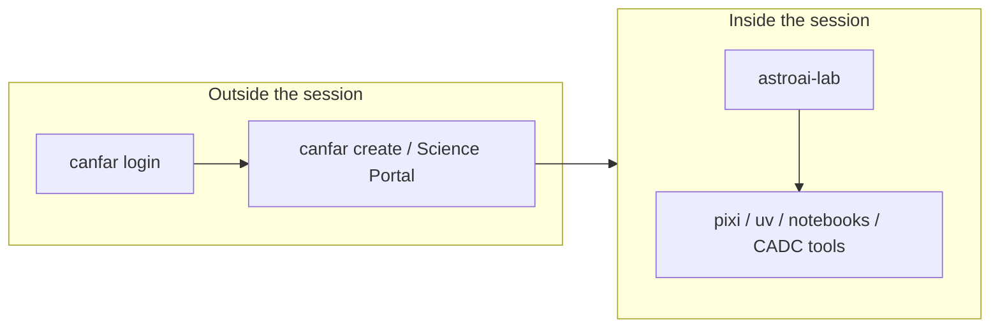

# Session guide

Short cheat sheet for work **inside** an AstroAI session on CANFAR.

## Who does what



| Tool | Use it for |
|------|------------|
| [`canfar`](https://github.com/opencadc/canfar) | Authenticate, create and list sessions, manage images, `canfar data` archive I/O |
| **`astroai-lab`** | Env save/resume, AI agents, session status, notebook kernels |
| CADC clients (`cadcget`, `vcp`, …) | Archive and VOSpace I/O (shipped in session images) |

Notebook path: Science Portal → **notebook** image →
`/opt/astroai/notebooks/starter.ipynb` →
`astroai-lab kernel ensure` if the kernel is missing.

Marimo path: Science Portal → **marimo** image →
`$WORK/notebooks/starter.py` opens by default.

## Storage tiers

| Tier | Typical path | Purpose |
|------|--------------|---------|
| Work | `WORK` → `/srcdir` | Ephemeral code (fast, session-local) |
| Scratch | `SCRATCH` → `/scratch` | Ephemeral data and package caches |
| Home | `/arc/home` | Persistent config and env saves |
| Projects | `/arc/projects` | Team persistent storage (read-only for most users) |

Env saves default to **`~/.astroai/lab/saves/`** on persistent home.

## Session loop

```text
1. astroai-lab resume mylab     # or init / clone
2. cd $WORK/mylab && pixi run …
3. … work …
4. astroai-lab save             # anytime; lockfile snapshot
```

CLI: **`astroai-lab help`** prints `--help` for every command
(`astroai-lab help -c agent` for one command).

## Daily commands

```bash
astroai-lab                       # brief status + next step
astroai-lab init mylab
astroai-lab clone owner/repo
astroai-lab save [name]
astroai-lab resume NAME
astroai-lab saves
astroai-lab status --json
astroai-lab kernel ensure
astroai-lab agent setup
astroai-lab agent install kilo     # or goose, opencode, qoder, …
astroai-lab agent remove kilo      # uninstall binary + config (--purge for home dirs)
astroai-lab agent wipe             # factory reset — remove EVERY agent config + binary + state (confirm required; --dry-run preview)
astroai-lab agent update
astroai-lab agent verify
astroai-lab agent verify --fix hermes   # regenerate/sanitize ONE agent's config
```

## Platform vs project Python

| Layer | Where | How it is versioned |
|-------|-------|---------------------|
| Platform CLIs | `/opt/astroai/venv/cadc` | Image build + optional `upgrade-cadc-tools.sh` this session |
| Your project | `$WORK` pixi/uv env | Lockfiles (`pixi.lock`, `uv.lock`) |

```bash
upgrade-cadc-tools.sh list
upgrade-cadc-tools.sh --upgrade astroai-lab
```

## Data

Use the platform: **`canfar data`** for archive I/O, and `vcp` / `vls` for
VOSpace. `astroai-lab` does not wrap data movement.

## Portable projects

Published repos use standard **`pixi.toml`** / **`pyproject.toml`** only.
`astroai-lab clone --from-env` is session-local bootstrap (cache warm / optional
lock copy) — lab-specific state is not committed to git.

## Shell completion

```bash
astroai-lab --install-completion bash   # or zsh, fish
```

## More

- [USAGE.md](USAGE.md) — full narrative
- [cli.md](cli.md) — flag and command reference
- [config.md](config.md) — optional preferences
- [CANFAR docs](https://opencadc.github.io/canfar/)
