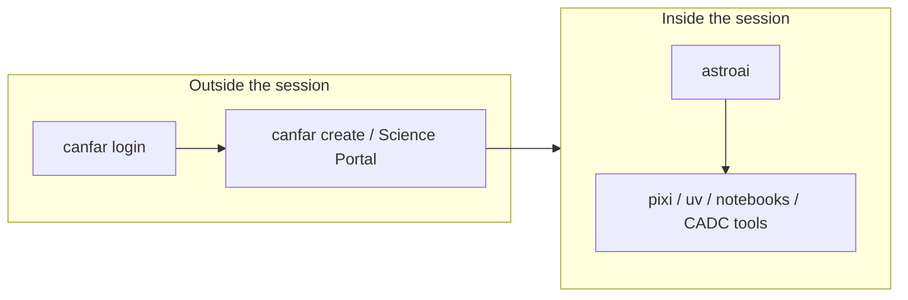

# Session guide

Short cheat sheet for work **inside** an AstroAI session on CANFAR.

## Who does what



| Tool | Use it for |
|------|------------|
| [`canfar`](https://github.com/opencadc/canfar) | Authenticate, create and list sessions, manage images, `canfar data` archive I/O |
| **`astroai`** | Env save/resume, AI agents, Ray cluster, session status, kernels |
| CADC clients (`cadcget`, `vcp`, …) | Archive and VOSpace I/O (shipped in session images) |

Notebook path: Science Portal → **notebook** image →
`/opt/astroai/notebooks/starter.ipynb` →
`astroai kernel ensure` if the kernel is missing.

Marimo path: Science Portal → **marimo** image →
`$WORK/notebooks/starter.py` opens by default.

## Storage tiers

| Tier | Typical path | Purpose |
|------|--------------|---------|
| Work | `WORK` → `$SCRATCH/src` on CANFAR | Ephemeral code (survives container OOM; dies with the session) |
| Scratch | `SCRATCH` → `/scratch` | Ephemeral data and package caches |
| Home | `/arc/home` | Persistent config and env saves |
| Projects | `/arc/projects` | Team persistent storage (read-only for most users) |

Env saves default to **`~/.astroai/lab/saves/`** on persistent home.

## Session loop

```text
1. astroai resume mylab     # or init / clone
2. cd $WORK/mylab && pixi run …
3. … work …
4. astroai save             # anytime; lockfile snapshot
```

CLI: **`astroai help`** prints `--help` for every command
(`astroai help -c agent` for one command).

## Daily commands

```bash
astroai                       # brief status + next step
astroai init mylab
astroai clone owner/repo
astroai clone owner/a owner/b
astroai save [name]
astroai save --list
astroai resume NAME
astroai status
astroai status --all          # groups and every team project
astroai status --json
astroai clean                 # list home caches; --yes to delete them
astroai kernel ensure
astroai agent setup
astroai agent install kilo     # or goose, opencode, qoder, …
astroai agent remove kilo      # uninstall binary + config (--purge for home dirs)
astroai agent wipe             # factory reset of every agent config, binary, and state
astroai agent update
astroai agent verify
astroai agent verify --fix hermes   # regenerate/sanitize ONE agent's config
astroai cluster start --autoscaling
astroai cluster check
astroai run train.py --cpus 2
```

## Platform vs project Python

| Layer | Where | How it is versioned |
|-------|-------|---------------------|
| Platform CLIs | `/opt/astroai/venv/cadc` | Image lock + `astroai --version` (`0.4.0+g<sha>` when installed from git) |
| Your project | `$WORK` pixi/uv env | Lockfiles (`pixi.lock`, `uv.lock`) |

```bash
upgrade-cadc-tools.sh list
upgrade-cadc-tools.sh --upgrade astroai-lab
```

## Data

Use the platform: **`canfar data`** for archive I/O, and `vcp` / `vls` for
VOSpace. `astroai` does not wrap data movement.

## Portable projects

Published repos use standard **`pixi.toml`** / **`pyproject.toml`** only.
`astroai clone --from-env` is session-local bootstrap (cache warm / optional
lock copy) — lab-specific state is not committed to git.

## Shell completion

```bash
astroai --install-completion bash   # or zsh, fish
```

## More

- [USAGE.md](USAGE.md) — full narrative
- [cli.md](cli.md) — flag and command reference
- [config.md](config.md) — optional preferences
- [CANFAR docs](https://opencadc.github.io/canfar/)
